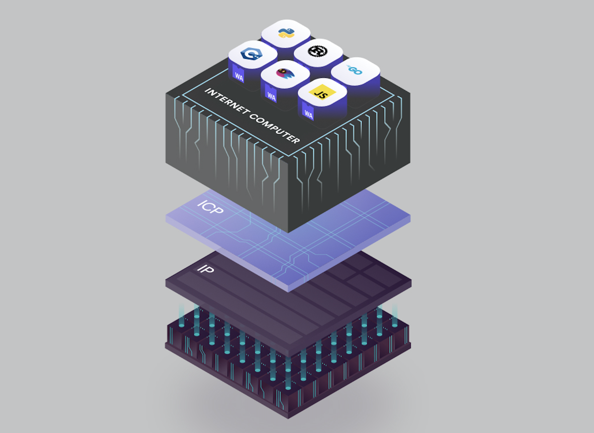
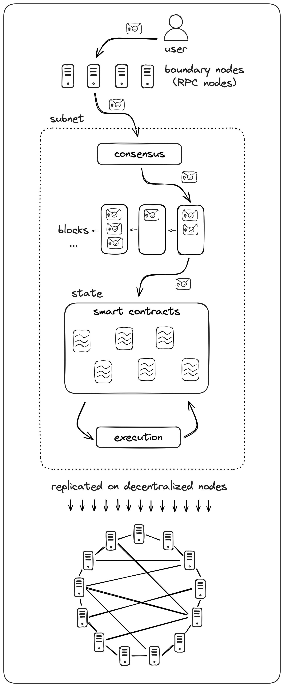

# Blockchain

Blockchain is a **decentralized** and **distributed** digital ledger that is used to record transactions across multiple computers or nodes. 

At its core, a blockchain is a chain of blocks, where each block contains a list of transactions. 
These blocks are linked together using cryptographic **hashes**, forming a continuous and immutable record of all transactions. 
This means that once a transaction is recorded on the blockchain, it cannot be altered or deleted.

One of the key features of blockchain is its decentralized nature.
Instead of relying on a central authority like a bank or government, blockchain relies on a network of computers, known as **nodes**, to validate and record transactions. 
This decentralization makes blockchain resistant to censorship and tampering, as there is no single point of failure.

Blockchain also employs **consensus** mechanisms to ensure the integrity of the data.
The most common consensus mechanism used in blockchain is called Proof of Work (PoW), where nodes compete to solve complex mathematical puzzles to validate transactions and add them to the blockchain.
This process requires a significant amount of computational power, making it difficult for malicious actors to manipulate the blockchain.

## How it Works [(Demo)](https://guggero.github.io/blockchain-demo/#!/)

Each block contains the *data*, *nonce* and two hashes: a *Prev* hash, which chains the last block to the current block, and a *Hash* of the current block. 
**Mining** is the process of validating the blocks. Using the nonce, a SHA-256 hash is generated for the block.
By mining, the nonce is adjusted to make the hash valid.
A valid hash could be one that starts with 3 0s.

Using Prev hash, the blocks are linked together. 
If we change data in a single block, it will invalidate every single subsequent block.
Re-mining in most distributed ledgers are almost impossible.

To make the ledger distributed, each person in the blockchain gets the same copy of the blockchain.
Hence, by **distributing**, we can identify if some data in a person's ledger is corrupted by comparing them with the other copies.
Now we have the Distributed Trustless Ledger.

Not only can we store data, but also we can create **Smart Contracts**: storing code inside a blockchain.
This allows for features like automating transactions when a particular condition, like reaching sufficient profit, is met.

## dApps - Decentralized Applications

dApps are the backbone of Web3. 
In this, we can build the technology, release tokens to public or to funds and raise money, and the companies can be run by **DAO**s (Decentralized Autonomous Organizations) which are users that hold special tokens named Governance Tokens.

*Pseudonimity* refers to how a user can be recognized by their id or username, but the actual identity remains hidden.

Ethereum is the most commonly used blockchain for dApps, but it has certain demerits like very high expense (gas price) on computation. 
The **Internet Computer** is a scalable cloud computer that runs on a blockchain. It can perform fast computations and store data directly on the chain.

# Internet Computer 



- [internetcomputer.org](https://internetcomputer.org/)
- [Documentation](https://internetcomputer.org/docs/current/developer-docs/)
- [Developer Journey](https://internetcomputer.org/docs/current/tutorials/developer-journey/) 

The Internet Computer Protocol is a blockchain designed to give smart contracts near-native performance and scalability, while maintaining the security of decentralized execution.
In addition to classical DeFi (Decentralized Finance) applications such as Ledgers and Exchanges, ICP can run computationally and storage-wise heavy applications like 

The goal of the Internet Computer is to reach *Blockchain Singularity*.
The entire base layout of the Web in one single blockchain.

Today's dApps are only partially decentralized. 
Small amount of data is on a secure blockchain, meanwhile majority of the data is stored in Web2 companies like Azure / AWS or relies on Chrome Extensions.
These companies have authority over these dApps.
Current blockchains are extremely difficult to be able to host large amount of data or transactions.
The low TPS (Transactions Per Second) limits the usage of the applications.

The Dfinity introduced a novel consensus algorithm named *Threshold Relay* which allows the Internet Computer to read much faster.
IC aggregates the computing capacity of a large number of independent *data centres* and combines them using the *Internet Computer Protocol* into a large decentralized *World Computer*.
The decentralized computer is organized into **Canisters**, which are simply **Smart Contracts**, that can run processes and store data.
Each canister is hosted on an independent blockchain network running on **nodes** called a **subnet**.
As a user you can interact with a canister by making an HTTPS request. 

The IC is a group of canisters, where each canister can hold programs and program states through **WebAssembly** *(Wasm)* (a binary instruction format, to which Motoko/Rust code is compiled to, and executed in the Wasm runtime provided by the IC network) Module and *Memory Page* (a fixed-size block of memory (64KB) used for managing memory allocation of a Wasm module (canister)).

We can write code to run web applications in WebAssembly using languages such as Rust, Motoko etc. 
The program states can be stored within the canister, similar to containers (e.g. Docker), but the **program state gets preserved** (runs forever). 
Thus, we don't have to worry about storage and we only have to think about the logic of the program. 

The Internet Computer Protocol is a **4 layer technology stack** that runs on the nodes of each subnet. Each subnet is capable of running a blockchain-based *Replicated State Machine* which is able to operate independently of other subnets while communicating asynchronously with them.
Each subnet processes messages, which are recieved from end users or other subnets.
The 4 layers are:

<table>
    <tr>
        <td></td>
        <td>
            <ol>
                <h3><li>Peer to Peer</li></h3>
                Responsible for communication between nodes within a subnet. <br/>
                Nodes on a subnet can broadcast messages, known as <i>artifacts</i> to all nodes in the subnets. 
                This is an asynchronous communication network.
                <h3><li>Consensus</li></h3>
                This layer is responsible for assuring that all nodes in a subnet agree on the messages that are processed and their order of processing. <br/>
                It provides <i>cryptographically guaranteed finality</i>.
                <h3><li>Message Routing</li></h3>
                Recieves a block of messages from the consensus layer and places them into the input queues of their associated target canisters - <b>Induction</b>.<br/>
                This triggers the execution process.<br/>
                <h3><li>Execution</li></h3>
                Execution layer is responsible for executing the canister smart contract code.<br/>
                The Wasm virtual machine running on each node is responsible for this process.<br/>
                Messages are executed until there are no more messages in the queue, or the cycles limit has been reached. <br/>
            </ol>
        </td>
    </tr>
</table>

Another core component of ICP is an array of advanced cryptographic mechanisms refered to as **Chain-key cryptography**. 
It uses a threshold signature scheme, in which the secret signing key is distributed among all the replicas in a subnet.
Chain-key signatures allow integration with other blockchains such as Bitcoin and Ethereum.

Canisters are computational units that bundle together both code and state.
It can define functions that can be called by external services like apps or browsers, or by other canisters.
A canister is managed by **Controllers**.
A controller can be a centralized entity, a decentralized entity like DAO, or no controller at all, which would make it an immutable smart contract. Only controllers can deploy, update code and start or stop the execution of a cansiter. 
They also ensure that the canister contains sufficient **cycles** to pay for the resources it consumes, which include network bandwidth (at times of usage, like message transfer), memory (at regular intervals) and computational power (at the time of computation).
Controllers can update the canister code, replacing the current Wasm module with new one.
By default, when updation happens, the canister clears out the Canister's memory.
But the content of the `stable` memory remains.

***ICP*** is the Internet Computer's utility token.
It has several functions, such as being staked to have voting power in the NNS (Network Nervous System: The DAO governing IC), or being used to purchase **cycles**, which power the canisters deployed on the mainnet. 
Each canister has a local cycles account used to store it's cycles.

***Internet Identity (II)*** is a secure and advanced form of cryptographich authentication by the Internet Computer. 
It can be integrated with dApps, and helps secure the user identity.

**Candid** is a language which allows communication between canisters in different languages. 
It is an Interface Description Language (IDL) with the primary purpose to describe the public interface of a service (program).
They allow us to interact with the service directly from the CLI, through a web based frontend, or programmatically.

## Terminology

| Term | Meaning |
|---|---|
Actor|A process with an encapsulated state, which communicates with other running actors, through asynchronous messages. Motoko uses actor-based programming model.|
Agent|Library used to make calls to the IC public interface. e.g. JavaScript, Rust|
Canister | A type of smart contract used in IC. Types: Backend canister, Frontend / asset canister, Custom canister.
Cycles|Unit of measurement used for resource consumption by a canister.|
dfx | Primary tool used for creating, managing and deploying canisters.
Identity | A principal value used for access control of canisters.
Principal|An entity that can be authenticated by ICP.|
Messages|Data sent from one canister to another, or from a user to a canister.|
Replica|Collection of protocol components necessary for a node to participate in a subnet.|
Smart contracts|Stateful programs that are designed to automatically execute, control, or document events and actions according to the configuration of the contract
Subnet|Collection of nodes that operate an independent instance of the blockchain network by running their own implementation of the consensus algorithm. They interact with other subnets through chain-key cryptography.|
Transaction|Transfer of ICP from one account to another. Types: Transfer, Minting, Burning|

## [Installation and Setup](./files/Installation+and+Setup+for+Windows.pdf)

1. Install Windows Subsystem for Linux (WSL)

    ```sh
    # Run on powershell as administrator
    wsl --install
    ```

2. Restart the computer.
3. Set up username and password.
4. Make sure WSL is installed properly.

    ```sh
    wsl --list --verbose
    ```

5. Install VSCode.
6. Install `Motoko` language extension from Dfinity.
7. Install WSL extension.
8. Install Homebrew in WSL.
9. Add brew to path by running the commands listed.
    
    ```sh
    /bin/bash -c "$(curl -fsSL https://raw.githubusercontent.com/Homebrew/install/HEAD/install.sh)"
    ```

10. Install homebrew dependencies.

    ```sh
    sudo apt-get install build-essential
    ```

11. Verify installation of brew.

    ```sh
    brew --version
    ```
12. Install Node into WSL

    ```sh
    brew install node@20
    node --version
    ```
    Optionally, run this if another version of node is already installed.
    ```sh
    brew link node@20
    ```

13. Install dfx

    ```sh
    sh -ci "$(curl -fsSL https://internetcomputer.org/install.sh)"
    ```

## [dfx](https://internetcomputer.org/docs/current/developer-docs/developer-tools/cli-tools/cli-reference/)

dfx is a command line utility used to interact with the IC SDK (Software Development Kit).
```
dfx [subcommand] [flag]
        ↑           ↑
    * new          -h --help
    * start        -q --quiet
    * stop         -v --verbose
    * build        -V --version
    * canister  
    * cycles    
    * deploy    
    * identity  
    * upgrade
    * ledger
    * help      
    * info
    * ping
    * quickstart
```

Use `dfx new [project_name]` to create a new project:

```
dfx new hello_world
```

You will be prompted to select the language that your backend canister will use:

```
? Select a backend language: ›
❯ Motoko
Rust
TypeScript (Azle)
Python (Kybra)
```

Then, select a frontend framework for your frontend canister.

```
? Select a frontend framework: ›
SvelteKit
❯ React
Vue
Vanilla JS
No JS template
No frontend canister
```

Lastly, you can include extra features to be added to your project:

```
? Add extra features (space to select, enter to confirm) ›
⬚ Internet Identity
⬚ Bitcoin (Regtest)
⬚ Frontend tests
```

To see the created project in file explorer, run `explorer.exe .` 
You can open the project in VS Code (`code .`).
Now, navigate into the project directory:
```sh
cd hello_world
```
The project structure will be like this:
```sh
hello_world/
├── README.md       # Default project documentation
├── dfx.json        # Project configuration file
├── node_modules    # Libraries for frontend development
├── package-lock.json
├── package.json
├── src             # Source files directory
│   ├── hello_world_backend
│   │   └── main.mo
│   └── hello_world_frontend
│       ├── index.html
│       ├── package.json
│       ├── public
│       │   ├── favicon.ico
│       │   └── logo2.svg
│       ├── src
│       │   ├── App.jsx
│       │   ├── index.scss
│       │   ├── main.jsx
│       │   └── vite-env.d.ts
│       ├── tsconfig.json
│       └── vite.config.js
└── tsconfig.json
```

Start the local, single-node IC network:
```sh
dfx start --clean
```
The *clean* option removes any orphan background processes or canister IDs that might cause conflicts.
The *background* option can be used to start the network in the background.
Deploy the created canisters into the local network:
```sh
dfx deploy
```
Now the project is deployed to the local network, and canisters are available at the link displayed in the terminal.
We can access the Frontend canister using the link, if a frontend canister is deployed. 
The URL to Candid interface can be utilized to interact with the backend.

**Motoko Playground** is a development environment that hosts a canister pool to which canisters can be deployed to.
Canisters deployed to the playground can borrow a small amount of cycles and can run for 20 minutes.
After 20 minutes the canister will be uninstalled, and the borrowed resources are returned to the canister pool.
```
dfx deploy [canister_name] --playground
```
This will deploy a single canister to Motoko playground. 
To interact with it directly, use the URL to the Candid Interface displayed in the terminal.

We can deploy our project to the mainnet using the command:
```
dfx deploy --network ic
```
but, this requires cycles.

## Cycles

Distribution of cycles are managed by a system canister called *cycles ledger*.
It provides functionality for converting ICP to cycles, accept incoming cycles, send cycles to other canisters and create canisters with cycles.
A developer's cycles balance is associated with their *principal identity*. 
Each canister uses cycles from their own cycles balance and not from the user's identity.
If there is not sufficient balance to call a method, or while creating a new canister, we have to proxy the call through the cycles ledger. 
We can top up a canister: deposit cycles into it's cycles balance.

In deployment to the mainnet, canisters will need to have cycles explicitly registered and transfered to them. 
We also have to configure *custodians*, which are principals that have explicit permission to send and recieve cycles for the canister.

The default developer identity is a public/private key pair created when we first use dfx. 
But the account identifier is derived from the public key. 
Account identifier is the one specified in the ICP ledger. 
Each principal can control multiple accounts.

Create a new developer identity using
```
dfx identity new DevJourney
```
Store the seed phrase returned for recovering the identity if lost.
Set this identity as the one to be used by dfx:
```
dfx identity use DevJourney
```
Get the principal id of this identity:
```
dfx identity get-principal
```
Obtain coupon for [free 10T cycles](https://anv4y-qiaaa-aaaal-qaqxq-cai.ic0.app/) and set the following environment variable to use cycles ledger and redeem the coupon:
```
DFX_CYCLES_LEDGER_SUPPORT_ENABLE=1
dfx cycles --network ic redeem-faucet-coupon COUPON_CODE
```
Check the balance:
```
dfx cycles --network ic balance
```
If we have ICP tokens, we can convert them to cycles.
```sh
# Get the account id
dfx ledger account-id
# Send ICP to this account and verify the balance
dfx ledger --network ic balance
# Convert 'AMOUNT' ICPs to Cycles
dfx cycles convert AMOUNT --network ic
# Check the cycles balance
```
Before deployment to the IC network, check connectivity:
```
dfx ping ic
```
Now deploy using `dfx deploy --ic` (shortcut). This will automatically deploy all canisters in the `dfx.json` file. 
To deploy only one canister run
```
dfx deploy canister_name --network ic
```
To access the dapp frontend, obtain the canister id:
```
dfx canister id projectName_frontend --network ic
```
Now our project is hosted 100% on-chain and is accessible through the URL 
```
https://<canister_id>.icp0.io
```

To add our identity as a controller, run:
```
dfx canister update-settings poll_backend --add-controller PRINCIPAL_ID
```
To view the controllers of a canister, use the `info` option.
```
dfx canister info canisterName
```
To check the current status of all canisters, run
```
dfx canister status --network ic --all
```
We can stop a cansiter through
```
dfx canister stop --network ic --all
```
And start them again
```
dfx canister start --network ic --all
```
We can control the maximum amount of reserved cycles in a canister by running:
```
dfx canister update-settings <canister-id> --reserved-cycles-limit 42 --ic
```
To `top-up` a specific canister using ICP, do
```
dfx ledger top-up <canister-id> --amount 2.7 --network ic
```
To use cycles ledger to top-up, run
```
dfx cycles top-up `AMOUNT` `CANISTER_ID` --network ic
```
If we stop and then delete a canister, it's balance comes back to the identity associated with the controller principal.
```
dfx canister delete `CANISTER_ID` --network ic
```
Freezing threshold is a value in seconds, which defines how many cycles the canister must retain in its cycles balance.
If the balance goes below the threshold, the canister will be frozen.
Default freezing threshold is 2_592_000s: 30 days.
This feature is to avoid running out of cycles, which causes the canister to uninstall.
We can update it by running
```
dfx canister update-settings poll_backend --freezing-threshold 3472000
```

# MOTOKO

<table><tr><td>
Motoko is the language specifically designed by DFINITY for canister development on ICP. <br/>
It has Candid support, Stable Memory support (memory persistence), uses Actor paradigm facilitates asynchronous data and control flow, and many more features.
        </td><td>
</td></tr></table>

```ts
// Declarations
let x = 1; 
let y = x + 1; 
x * y + x; // Expression (stored in an unknown variable)

// Block using 'do {};'
let z = do {    // z stores the output
  let x = 1;
  let y = x + 1;
  x * y + x
}; // Blocks end with a ';'
```
Declarations introduce immutable variables, whereas, expressions define computations involving them.

Using the `import` keyword, we can import the *Motoko Base Library*.
After the keyword, a local module name and file path of the module should be provided.
Also, we can import other Motoko programs.

```ts
import Debug "mo:base/Debug"; // Import Debug.mo from base lib
import Types "./types"; // Import a Motoko program named types.mo

Debug.print("hello world"); // Prints a string
```

Type `Nat` refers to Natural Numbers. Nat is unbounded.
```ts
let x = 42 + (1 * 37) / 12: Nat
```
An `actor` is a process with encapsulated state that communicates with other running actors. To define an actor:
```ts
actor {
    //actor code goes here
}
```
Actors can have names:
```ts
actor Counter {
    // ...
}
```
Primitive values available in Motoko are

* Boolean: `true`, `false`
* Integers: ...-1, 0, 1,... (bounded and unbounded)
* Natural Numbers: 0, 1,... (bounded and unbounded)
* Text values: Strings of Unicode characters

Non-primitive values include

* Tuples
* Arrays
* Objects
* Variants
* Function values
* Async values
* Error values

We can declare a new type like:
```ts
type Counter = {
    topic : Text;
    value : Nat;
};
```

To convert a value to human-readable text, use `debug_show`:
```ts
Debug.print(debug_show(("hello", 42, "world")))
// Output: ("hello", 42, "world")
```
A **function** that takes a `Text` as an argument, and returns an output of type `Text`:

```ts
actor {
    public func location(city : Text) : async Text {
        return "Hello, " # city # "!";
    };
};
```
We can call the above function:
```ts
> dfx canister call location_hello_backend location "San Francisco"
// Output: ("Hello, San Francisco!")
```
All functions that returns values must be declared as `async`.

### Query calls v Update calls

A `Query call` is a function that does not alter any data. 
It is executed on a single node of a subnet. 
It has low resource consumption and lightning fast response.

An `Update call` is executed on all nodes of a subnet. The result must pass through consensus on the subnet, and update calls has the ability to alter data. 
Update calls are slow and expensive.

### Data Structures

For storing key-value pairs, we can use a `HashMap` or `RBTree`.
```ts
// Initializing an RB Tree
var votes: RBTree.RBTree<Text, Nat> = RBTree.RBTree(Text.compare);
```
The function below returns an array of entries in an RB tree:
```ts
public query func getVotes() : async [(Text, Nat)] {
    Iter.toArray(votes.entries())
};
// Eg.[["Motoko","0"],["Python","0"],["Rust","0"]]
```
We can get an element from the hashmap using the `get()` method and insert using `put()`.
Note that *get()* returns an element of type `?Nat`, which means, it either returns a value of type `Nat` or `null`, if the value key is absent.
```ts
let votes_for_entry :?Nat = votes.get(entry);
// Converting to Nat
let current_votes_for_entry : Nat = switch votes_for_entry {
    case null 0;
    case (?Nat) Nat;
};
votes.put(entry, current_votes_for_entry + 1);
```
---

**Stable Variables** can be declared like:

```ts
actor Counter {
  stable var value = 0;
  ...
}
```

A **Local Function** will block the entity making a call to the function until the function has returned a result.
A **Shared Function** immediately returns a value known as the **future**.
It means that, an asynchronous value is expected to be returned.

We can implement a project with multiple actors, in separate `main.mo` files.

## JavaScript

For implementing the frontend, we have establish communciation with the backend canister.
We can import an interface for the backed in the JavaScript file like:
```jsx
import { projectName_backend } from "../../declarations/projectName_backend";
```
The methods in the backend can be called asyncronously from the frontend like:
```jsx
const voteCounts = await poll_backend.getVotes();
```


## Canisters

**Stable Memory** is the unique feature of IC data store separate from the canister's regular Wasm memory store, known as **Heap Memory**.
Stable memory enables long-term data storage.

Heap memory does not persist across upgrades, and is cleared when the canister is upgraded or reinstalled.
Heap memory size is limited to 4GB.
Stable memory persists across upgrades, has a much larger capacity, and is very beneficial for vertical scaling.
We need to indicate which canister data we want to be retained after upgrades.
Stable memory can hold upto 400GB.

Upgrading is the process of making changes to a canister's code, which was already deployed.

A stable variable is a variable defined within an actor using the `stable` keyword. 
This indicates that data stored in the variable should be in stable storage.

We can try stopping the canister and reinstalling to check if the value has been retained.

```sh
dfx canister stop counter_backend
dfx canister install counter_backend --mode upgrade
dfx canister start counter_backend
```

*Certified Variables* can be used to enable queries to return an authenticated response that can be verified and trusted.
Normal query calls do not go through consensus and thus cannot be trusted.
Certified variables are generated using Chain-key cryptography and are thus, accurate and secure.

Inter-canister calls refer to the ability to make calls between different canisters. 
The `shared` keyword is used to share functions across actors.
```ts
type SubscribeMessage = { callback: shared () -> (); };
```

**Third Party Canisters** are canisters that provide a public service at a static canister ID.
Some examples are the Dfinity NNS and Internet Identity.
They can be used to add additional functionality to the dapps.
dfx enables a *dependency* workflow, where a canister is able to pull a third party canister that it depends on into the local environment.

To add the Internet Identity canister with id `rdmx6-jaaaa-aaaaa-aaadq-cai` as a dependency, we need to edit the `dfx.json` file:
```json
// ...
"canisters": {
    // ...
    "internet_identity": {
        "type": "pull",
        "id": "rdmx6-jaaaa-aaaaa-aaadq-cai"
    },
},
// ...
```
And run the following command to download the Wasm module of the  dependency canister:
```sh
dfx deps pull
```
Now set the `init` arguments for the dependencies:
```sh
dfx deps init
dfx deps init <canister_id> # In case of errors
dfx deps init <canister_id> <arguments>
```
Now deploy the pulled dependency canister:
```
dfx deps deploy
```
and then, deploy our project with `dfx deploy`. 
Now the dependency canister is deployed locally, and we can interact with it using the Candid URL displayed.

The candid serivce description files are those that have the extension `.did`. 
These contain descriptions on methods defined in the backend code `main.mo`. 
When the code is compiled, the Candid description is automatically generated. 
While calling a function using 
```sh
dfx canister call <canister_id> <method> <arguments>
```
we are actually interacting with the Candid description inside the `/declarations` folder.
The URL of the Candid Interface that shows up while deploying takes us to the Candid UI, which lets us call methods from the graphical interface.

In IC, canisters can communicate directly with external servers or other blockchains through **HTTPS Outcalls**.
It supports GET, HEAD and POST methods.

## Testing

We can perform unit testing, integration testing as well as End2end (e2e) testing in the production environment.
A sample unit test is given below:
```ts
import M "mo:matchers/Matchers";
import T "mo:matchers/Testable";
import Suite "mo:matchers/Suite";

let suite = Suite.suite("My test suite", [
    Suite.suite("Nat tests", [
        Suite.test("10 is 10", 10, M.equals(T.nat(10))),
        Suite.test("5 is greater than three", 5, M.greaterThan<Nat>(3)),
    ])
]);
Suite.run(suite);
```
```ts
```

## Tokens


For automatic reload on the frontend, run
```sh
npm start
```
To charge a cansiter, do
```sh
# Get canister id
dfx canister id <canister_name> # May not work
# Save it to a command line variable
CANISTER_PUBLIC_KEY="principal \"$( \dfx canister id token )\""

echo $CANISTER_PUBLIC_KEY

# Transfer
dfx canister call token transfer "($CANISTER_PUBLIC_KEY, 500_000_000)"
```
```sh
```